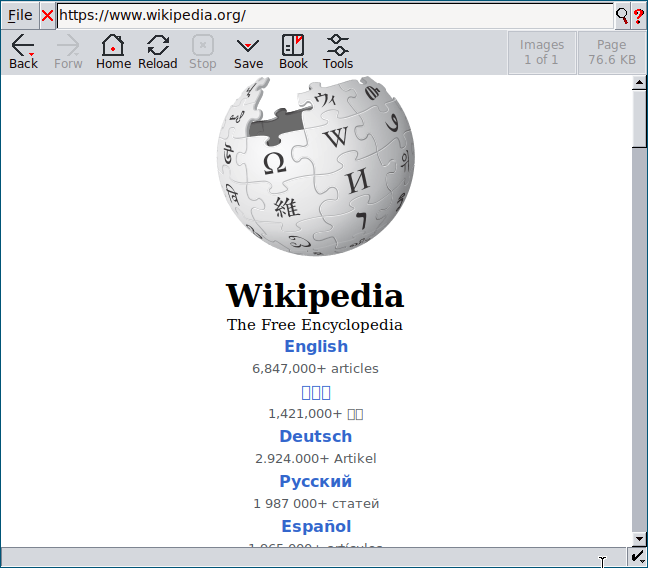
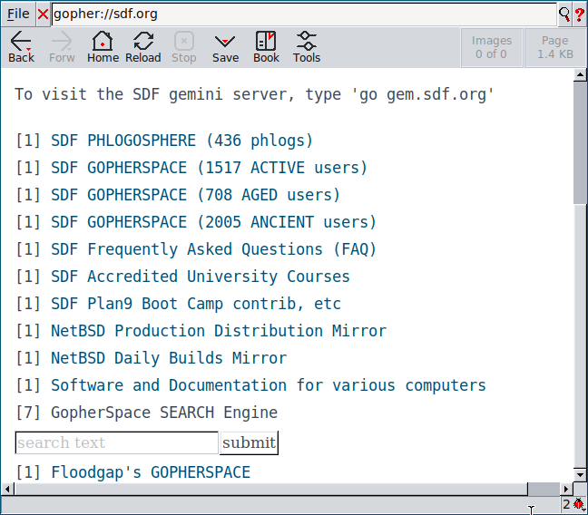
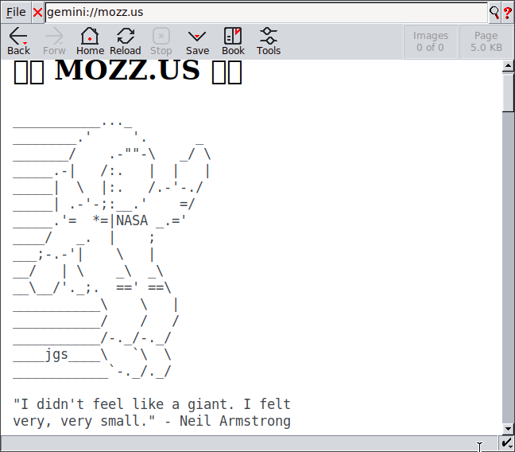
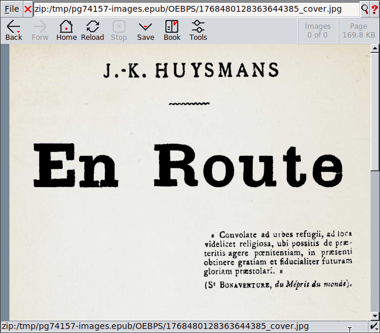
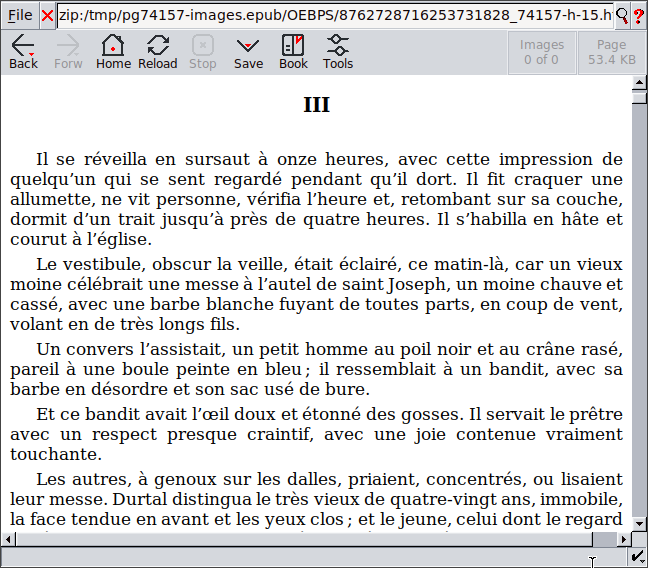

# Overview
[](screenshots/main.png)

**Dillo+** (Dillo-Plus) is a lightweight (about 10MB) *multi-protocol browser* for Linux, BSD and unix OS in general, that does not use Javascript but still support many advanced features.

This project is a port of the official Dillo that is located at https://dillo-browser.github.io/old/ with additions and fixes in part developed by me and in part merged from the DilloNG project located at https://github.com/w00fpack/dilloNG/.

Lightweight browsers, such as Dillo, are beneficial for loading websites quickly.  Also, lightweight web browsers can work on older hardware where common browser would take up too many resources, that could freeze up your computer.

Because javascript is not used, extra bloat is not needed to be downloaded.  If you have a slow internet connection, a web page that might have taken 3MB to download might only be 400kB with Dillo+.

Finally, your online experience can be more secure with Dillo+. Not only does it not use Javascript, rules can also be defined per website domain. These rules can block connecting to certain domains, block ads and trackers, and require sites to use encryption.

Note that not all websites will work correctly without Javascript, so be forewarned.

# Browser Features

Many features where added to the base Dillo code. Here are some highlight.

## Gopher and Gemini protocols

Dillo+ supports the lightweight protocols **gopher** and **gemini** in addition to http and https. It aims to become your default browser for accessing the smol web.

Gopher screenshot:

[](screenshots/gopher.png)

Gemini screenshot:

[](screenshots/gemini.png)

## Reader mode CSS style

To make it easier reading articles from the web, and also to rearrange large pages in a format easier on the eyes, it is possible to activate a reader mode CSS from the 'Tools' menu.

## Additional content types

Support for rendering pages and local files written in the **gemini**, **gopher**, **markdown** and **rss** formats has been added.

## Additional DPIs

To implement some advanced features, like **epubs** and **manpages** reading, a series of additional DPI modules has been added by default to the browser.

Current additional DPIs are:
- **File**: file browser able to render files according to their type, with some improvements over the original dillo DPI (URL protocol *file://*)
- **Zip**: file browser for zip archives able to render compressed files according to their type, including HTML files (and their links and referenced resources) to easily visualize EPub ebooks (URL protocol *zip://*)
- **Man**: man page viewer with man links support, very handy on a *nix system to quickly navigate the docs (URL protocol *man://*)
- **Ftp**: file browser for the FTP protocol which also supports the OpenBSD ftp client and not only wget (URL protocol *ftp://*)
- **Gemini**: browser for the Gemini protocol (URL protocol *gemini://*)
- **Gopher**: browser for the Gopher protocol (URL protocol *gopher://*)

Here are some screenshots of the Epub reader:

[](screenshots/epub1.png)
[](screenshots/epub2.png)

## Searching

If wanted, there is a search dialog that is available by pressing 's'. It includes your search engines that are defined in your dillorc file. 

### Quick Searching

You can search common sites by typing one of the following key letters, followed by a space and your search term.
For example, 'dd pizza', will search the Duck Duck Go website for the term 'pizza'.

```
dd - to search DuckDuckGo
se - to search SearX (searx.be)
se2 - to search2 SearX (searxng.ch)
se3 - to search3 SearX (searxng.ca)
se4 - to search4 SearX (priv.au)
ya - to search Yandex
wk - to search Wikipedia
wt - to search Wiktionary
wc - to search Wikicommons
wb - to search Wikibooks
wv - to search Wikiversity
wy - to search Wikivoyage
ar - to search Internet Archive
fd - to search Free Dictionary
sp - to search Startpage
mn - to search Marginalia
te - to search Teclis
gg - to search Google
ge - to search GeminiSpace
lg - to search LibGen
gr - to search GoodReads
pb - to search The Pirate Bay
tw - to search Twitter
un - to search Unsplash
dv - to search Deviant Art
dw - to search Debian Wiki
aw - to search Arch Wiki
gw - to search Gentoo Wiki
ow - to search OpenSuse Wiki
sl - to search Slackware Docs
db - to search Debian Package
ap - to search Arch Package
fp - to search Fedora Package
ob - to search OpenBSD Package
os - to search OpenSuse Package
fb - to search FreeBSD Man
```

To modify these quick searches, refer to this link.

## External media player

Dillo+ does not play media, such as audio and video, in the browser.  Instead you can run media using your preferred desktop media player.  The benefit is that playback will usually be more streamlined, without jitter.  Your media player might also have options, such as video caching of live streams, recording, streaming and downconverting.

[](screenshots/media_playing.png))

# Installation

## Pre-built Releases

Please check under releases

## Requirements

Please see https://dillo-browser.github.io/old/ for requirement details.

In brief, these dependencies are sufficient for the browser:
* libiconv
* FLTK 1.3
* OpenSSL/LibreSSL

To enable image rendering install also:
* libjpeg
* libpng
* libgif

On Debian-based systems with OpenSSL, you can run `apt install libiconv-hook1 libfltk1.3-dev libglx-dev libgl-dev libopengl-dev libssl-dev libxrender-dev libxfixes-dev libxcursor-dev libxext-dev libxinerama-dev libfontconfig1-dev libxft-dev libfontconfig-dev` to install dependencies, but some of these may need manually installed from the .deb (obtainable from `apt download [package]`) with `dpkg --force-all -i [path-to-package]`.

## INSTALLATION AND COMPILING

The compilation system has been converted from the autotools suite used by the original dillo (see https://dillo-browser.github.io/old/ for the old install details) to a plain Makefile system.

Before compiling the code you can personalize some compilation options in the [Makefile.options](Makefile.options) files.

Some preconfigured options are provided for common setups:
* [Makefile.options.Linux](Makefile.options.Linux)
* [Makefile.options.Linux.Wayland](Makefile.options.Linux.Wayland) (thanks to @XDream8)
* [Makefile.options.OpenBSD](Makefile.options.OpenBSD)
* [Makefile.options.MacOS](Makefile.options.MacOS) (thanks to @bouncepaw)

Replace Makefile.options with the correct config for your system.

After that just run:
```
make
make install
```

Some additional instructions to compile Dillo+ on MacOs with Homebrew, and a prebuilt package can be found at this link: [dilloformacos](https://sites.google.com/view/dilloformacos/home-page) (thanks to Mepy).

# Quickstart

1. Obtain a release for your OS distribution, or compile Dillo from this repository's source code
2. Install the application, and Click on the "Dillo+" menu option.
3. Browse the internet the way you normally would

# Contributing

You can access the original code repository at https://dillo-browser.github.io/old/. If you would like to use this GIT repository to submit code changes, please open pull requests against this GitHub repository. Here's some general guidelines when submitting PRs:

 * In your pull request, please:
   * Describe the changes, why they were necessary, etc
   * Describe how the changes affect existing behaviour
   * Describe how you tested and validated your changes
   * Include any relevant screenshots/evidence demonstrating that the changes work and have been tested

**Enjoy using Dillo+!**
